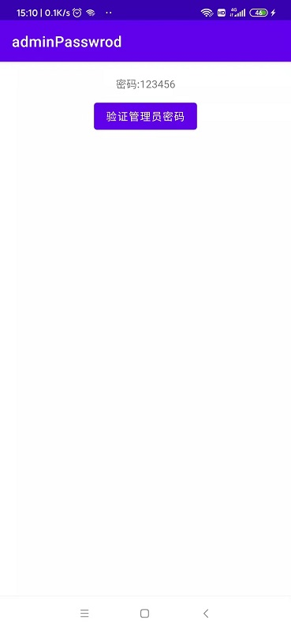

# adminPasswrod：自定义密码弹窗控件

### 一、效果预览

### 二、快捷使用
    PasswordView passwordView = new PasswordView(this);
            BottomSheetDialog bottomSheetDialog = new BottomSheetDialog(this);
            bottomSheetDialog.setContentView(passwordView);
            bottomSheetDialog.setCanceledOnTouchOutside(false);
            bottomSheetDialog.show();